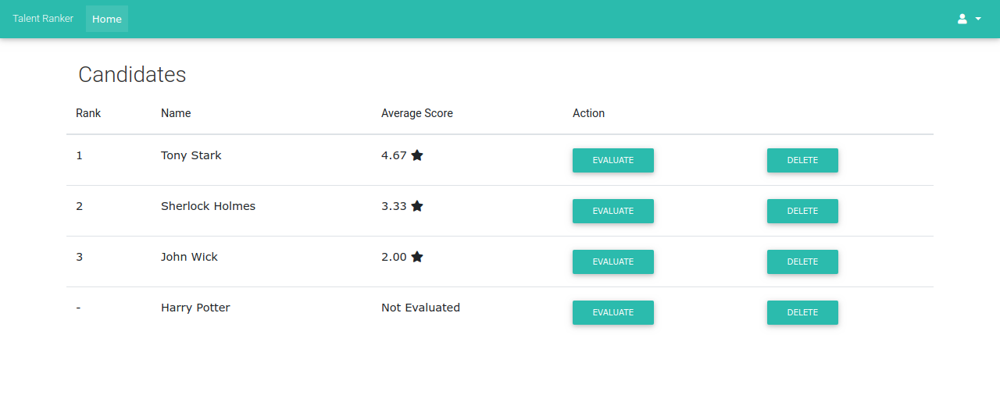

[](https://heroku.com/deploy)

<br />
<p align="center">
  <a href="https://github.com/mfrashad/ranker">
    <h2 align="center">Talent Ranker</h2>  
  </a>
  <p align="center">
    A website that ranks candidates based on manager or HR evaluation.
    <br />
    <a href="https://github.com/mfrashad/ranker"><strong>Explore the docs »</strong></a>
    <br />
    <br />
    <a href="https://employee-ranker.herokuapp.com/">View Demo</a>
    ·
    <a href="https://github.com/mfrashad/ranker/issues">Report Bug</a>
    ·
    <a href="https://github.com/mfrashad/ranker/issues">Request Feature</a>
  </p>
</p>


<!-- TABLE OF CONTENTS -->
## Table of Contents

* [About the Project](#about-the-project)
  * [Built With](#built-with)
* [Getting Started](#getting-started)
  * [Prerequisites](#prerequisites)
  * [Setup](#setup)
* [Contributing](#contributing)
* [License](#license)
* [Acknowledgements](#acknowledgements)


<!-- ABOUT THE PROJECT -->
## About The Project



A website that ranks candidates based on manager or HR evaluation.

### Built With

* [MDBootstrap](https://mdbootstrap.com/)
* [rails_apps_composer](https://github.com/RailsApps/rails_apps_composer)

This application was generated with the [rails_apps_composer](https://github.com/RailsApps/rails_apps_composer) gem
provided by the [RailsApps Project](http://railsapps.github.io/).

Rails Composer is supported by developers who purchase our RailsApps tutorials.


<!-- GETTING STARTED -->
## Getting Started

### Prerequisites

Ruby on Rails


This application requires:

- Ruby 2.5.3
- Rails 5.2.3

Learn more about [Installing Rails](http://railsapps.github.io/installing-rails.html).


### Setup
Make sure you have installed the required ruby and rails.
Then run these commands in the root directory to run the app.
```
$ bundle install # Install gem dependencies
$ rails db:setup # Setup database
$ rails server # Run server
```
The app will be run on `localhost:3000` by default.


<!-- CONTRIBUTING -->
## Contributing

Contributions are what make the open source community such an amazing place to be learn, inspire, and create. Any contributions you make are **greatly appreciated**.

1. Fork the Project / Clone the project (For members that have been given access)
2. Create your Feature Branch (`git checkout -b feature/AmazingFeature`)
3. Commit your Changes (`git commit -m 'Add some AmazingFeature'`)
4. Push to the Branch (`git push origin feature/AmazingFeature`)
5. Open a Pull Request


<!-- LICENSE -->
## License

Distributed under the MIT License. See `LICENSE` for more information.


<!-- ACKNOWLEDGEMENTS -->
## Acknowledgements
* [Img Shields](https://shields.io)
* [Font Awesome](https://fontawesome.com)
* [Heroku](https://www.heroku.com/)


